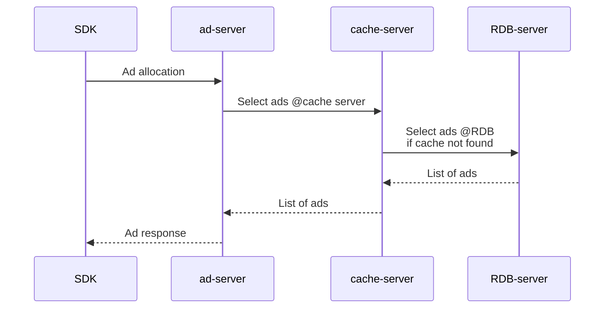
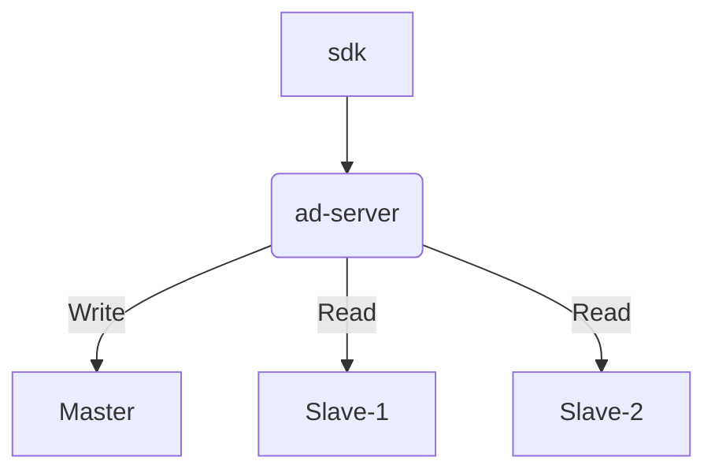

# Overview
안녕하세요 버즈빌 [광고 제품팀] 서버 개발자 지원자 서동원 입니다.<br>
2차 과제전형 기회를 주신 점 감사의 말씀 드립니다.<br>
과제를 진행하면서 버즈빌에 합류하게 되면 어떤 업무를 주로 하게 될지 간접적으로 알 수 있는 기회가 되어 너무 좋았습니다.<br>
도커 컨테이너 환경 구축 등 추가 학습이 필요한 부분에서 시간이 예상보다 더 소요되었지만 새로운 기술을 익히고 본 프로젝트 개발을 진행하며 너무 재밌었습니다.<br> 
버즈빌에 합류하여 좋은 기회가 있기를 바랍니다.<br>
<br>
감사합니다.<br>
서동원 드림<br>
dongwon.sehr@gmail.com<br>

본 프로젝트(ads-project) 의 목차는 다음과 같습니다.
- [Overview](#overview)
- [개발 일정](#개발-일정)
- [API](#api)
  - [1. 광고 송출 API](#1-광고-송출-api)
  - [2. 개선된 광고 송출 API](#2-개선된-광고-송출-api)
    - [광고 정책 추가](#광고-정책-추가)
    - [DB Replication](#db-replication)
    - [Redis 캐시 서버](#redis-캐시-서버)
    - [송출 ID 값 생성](#송출-id-값-생성)
  - [3. 광고 리워드 수정 API](#3-광고-리워드-수정-api)
  - [4. 유저 리워드 적립 API](#4-유저-리워드-적립-api)
    - [테이블 구조](#user-테이블)
    - [유저 리워드 적립 API 워크플로우](#유저-리워드-적립-api-워크플로우)
  - [5. 유저 리워드 차감 API](#5-유저-리워드-차감-api)
  - [6. 유저 리워드 조회 API](#6-유저-리워드-조회-api)
  - [7. 유저 리워드 최근 내역 조회 API](#7-유저-리워드-최근-내역-조회-api)
- [도커 컨테이너](#도커-컨테이너)
  - [MySQL 서버 초기 세팅](#mysql-서버-초기-세팅)
  - [지원하는 API](#지원하는-api)

<br>

# 개발 일정
[[서동원] 버즈빌 - 서버 개발자 2차 과제 진행일정 (23.01.09 ~ 23.01.16)](https://docs.google.com/spreadsheets/d/1jOQj0KJdN3cZJ8sZGsvLAc-BPrhJpKY0Y58JpGvxMng/edit?usp=sharing "[서동원] 버즈빌 - 서버 개발자 2차 과제 진행일정 (23.01.09 ~ 23.01.16)")

<br>

# API
## 1. 광고 송출 API
다음과 같이 API 구조를 설계했습니다.
유저의 gender, country 를 기반으로 타겟 광고 후보 리스트를 조회 후, 광고의 weight 를 기반으로 최종 타겟 광고를 결정하여 응답합니다. 
이후 동일한 유저 정보로 다시 요청이 올 경우, Redis 에 캐싱된 데이터를 조회하여 응답 속도를 개선했습니다.



### API Usage
<table>
	<tr>
		<td> Request URL </td>
		<td> http://localhost:8080/api/v1/target-ads </td>
	</tr>
	<tr>
		<td> Method </td>
		<td> GET </td>
	</tr>
	<tr>
		<td> Parameters </td>
		<td>
			<table>
				<tr>
					<th>Field</th>
					<th>Type</th>
					<th>Required</th>
					<th>Remarks</th>
				</tr>
				<tr>
					<td>user_id</td>
					<td>int</td>
					<td>mandatory</td>
					<td></td>
				</tr>
				<tr>
					<td>gender</td>
					<td>string</td>
					<td>mandatory</td>
					<td>"M" or "F"</td>
				</tr>
				<tr>
					<td>country</td>
					<td>string</td>
					<td>mandatory</td>
					<td>2-digit country code</td>
				</tr>
				<tr>
					<td>ignore_cache</td>
					<td>int</td>
					<td>optional</td>
					<td>1 or 0 (default 0: use cache)</td>
				</tr>
			</table>
		</td>
	</tr>
	<tr>
		<td>Caller Example</td>
		<td>http://localhost:8080/api/v1/target-ads?user_id=1&gender=F&country=KR</td>
	</tr>
	<tr>
		<td>Response Example</td>
<td>

```json
[
    {
        "id": 181,
        "name": "campaign name 181",
        "image_url": "https://image.buzzvil.com/image_181.jpg",
        "landing_url": "https://landing.buzzvil.com/landing_181",
        "reward": 6
    },
    {
        "id": 896,
        "name": "campaign name 896",
        "image_url": "https://image.buzzvil.com/image_896.jpg",
        "landing_url": "https://landing.buzzvil.com/landing_896",
        "reward": 4
    },
    {
        "id": 545,
        "name": "campaign name 545",
        "image_url": "https://image.buzzvil.com/image_545.jpg",
        "landing_url": "https://landing.buzzvil.com/landing_545",
        "reward": 3
    }
]
```

</td>
	</tr>
</table>

## 2. 개선된 광고 송출 API
기본 API 구조는 1.광고 송출 API 와 동일하며 개선된 점은 다음과 같습니다.
### 광고 정책 추가
유저의 user_id 값을 4로 나눈 나머지(MOD) 에 따라 다음 광고 정책 중 한 가지를 선택합니다. 각 광고 정책 방식에 따라 최종 타겟 광고를 결정하여 응답합니다.

| 광고 정책 | MOD | 설명 |
| - | :-: | - |
| random | 0 | 랜덤 정렬 |
| weight | 1 | 광고 weight 기반 랜덤 정렬 |
| pctr | 2 | CTR 예측값의 내림차순 정렬 |
| weight_pctr_mixed | 3 | CTR 예측값이 가장 높은 광고를 첫 번째에 위치하고 나머지 두 광고는 weight 기반 정렬 |

신규 광고 정책을 추가하는 방법은 아래와 같습니다.
1.  광고 정책 모듈 `./workspace/library/ad_policy` 의 추상 클래스 `AdPolicy` 를 상속하여 새로운 광고 정책 클래스를 생성
2.  광고 정책 선택자 클래스 `AdPolicySelector` 의 생성자 함수에서 정책 결정 로직 수정

### DB Replication
트래픽이 증가할 경우를 대비해 DB 를 Master-Slave-Slave 구조로 Replication 했습니다.
쓰기(INSERT, UPDATE) 는 Master DB, 읽기(SELECT) 는 Slave DB 로 트래픽을 분산합니다. 현재 구조로도 힘들 정도로 트래픽이 증가할 경우 Slave DB 노드를 병렬로 증가시켜 유연하게 대응할 수 있습니다.


### Redis 캐시 서버
1\. 광고 송출 API 작업 부터 고려하여 구축한 캐싱 서버로, 동일한 유저 정보의 조건으로 요청이 다시 올 경우 RDBMS 서버의 부담을 줄이고 빠른 캐싱 데이터로 응답 속도 성능을 높였습니다.
Redis 모듈 `./workspace/library/redis.php` 을 개발할 때 고려했던 점은 캐싱을 할 때 TTL 을 설정할 수 있게 파라미터로 추가했고 개발 시 테스트와 추후 운영에 필요할 수 있는 키 삭제나 만료 메서드도 같이 개발하였습니다.

### 송출 ID 값 생성
추후 리워드 적립 API 에서 한 번 송출 받은 광고로 리워드 중복 적립을 방지 하기 위해 송출 정보 ID 를 생성했습니다. 송출 ID 는 송출 시간과 유저 아이디를 조합하여 생성한 해시값 입니다.
### API Usage
<table>
	<tr>
		<td> Request URL </td>
		<td> http://localhost:8080/api/v3/target-ads </td>
	</tr>
	<tr>
		<td> Method </td>
		<td> GET </td>
	</tr>
	<tr>
		<td> Parameters </td>
		<td>
			<table>
				<tr>
					<th>Field</th>
					<th>Type</th>
					<th>Required</th>
					<th>Remarks</th>
				</tr>
				<tr>
					<td>user_id</td>
					<td>int</td>
					<td>mandatory</td>
					<td></td>
				</tr>
				<tr>
					<td>gender</td>
					<td>string</td>
					<td>mandatory</td>
					<td>"M" or "F"</td>
				</tr>
				<tr>
					<td>country</td>
					<td>string</td>
					<td>mandatory</td>
					<td>2-digit country code</td>
				</tr>
				<tr>
					<td>ignore_cache</td>
					<td>int</td>
					<td>optional</td>
					<td>1 or 0 (default 0: use cache)</td>
				</tr>
			</table>
		</td>
	</tr>
	<tr>
		<td>Caller Example</td>
		<td>http://localhost:8080/api/v3/target-ads?user_id=1&gender=F&country=KR</td>
	</tr>
	<tr>
		<td>Response Example</td>
<td>

```json
{
    "response_at": "2023-01-16 18:20:27",
    "policy": "weight",
    "ad_issue_id": "9010f49e89c87e20c18ee7b539bfd275",
    "target_ads": [
        {
            "id": 336,
            "name": "campaign name 336",
            "image_url": "https://image.buzzvil.com/image_336.jpg",
            "landing_url": "https://landing.buzzvil.com/landing_336",
            "reward": 5
        },
        {
            "id": 74,
            "name": "campaign name 74",
            "image_url": "https://image.buzzvil.com/image_74.jpg",
            "landing_url": "https://landing.buzzvil.com/landing_74",
            "reward": 7
        },
        {
            "id": 784,
            "name": "campaign name 784",
            "image_url": "https://image.buzzvil.com/image_784.jpg",
            "landing_url": "https://landing.buzzvil.com/landing_784",
            "reward": 6
        }
    ]
}
```

</td>
	</tr>
</table>

## 3. 광고 리워드 수정 API
광고 데이터의 리워드 값을 관리자의 요청으로 수정할 수 있는 API 입니다.
파라미터 검증시 리워드 값이 음수가 될 수 없도록 조건을 확인했고 추가로 광고 리워드의 최대 제한 값을 설정하여 비정상적으로 큰 값의 요청도 예외처리를 했습니다. 캐시도 태울 필요 없는 간단한 API 지만 로컬 도커 개발 환경에서 HTTP PUT method 요청시 Redirection 되어 GET method 로 변경되는 이슈가 있어 임시로 GET 요청 파라미터를 파싱하여 처리하였습니다.

### API Usage
<table>
	<tr>
		<td>Request URL</td>
		<td>localhost:8080/api/v3/ad-reward</td>
	</tr>
	<tr>
		<td>Method</td>
		<td>PUT</td>
	</tr>
	<tr>
		<td>Parameters</td>
		<td>
			<table>
				<tr>
					<th>Field</th>
					<th>Type</th>
					<th>Required</th>
					<th>Remarks</th>
				</tr>
				<tr>
					<td>ad_id</td>
					<td>int</td>
					<td>mandatory</td>
					<td></td>
				</tr>
				<tr>
					<td>reward</td>
					<td>int</td>
					<td>mandatory</td>
					<td>negative value not accepted</td>
				</tr>
			</table>
		</td>
	</tr>
	<tr>
		<td>Caller Example</td>
		<td>
			<table>
				<tr>
					<td>Request URL</td>
					<td>localhost:8080/api/v3/ad-reward</td>
				</tr>
				<tr>
					<td>Method</td>
					<td>PUT</td>
				</tr>
				<tr>
					<td>Body</td>
<td>

```json
{
	"ad_id": 1,
	"reward": 10
}
```

</td>
				</tr>
			</table>
		</td>
	</tr>
	<tr>
		<td>Response Example</td>
<td>

```json
{
    "response_at": "2023-01-16 19:13:15",
    "result": {
        "ad_id": 100,
        "reward": 3
    }
}
```

</td>
	</tr>
</table>


## 4. 유저 리워드 적립 API
유저 정보의 리워드 값을 수정, 조회하는 API 이며 이를 위해 추가로 다음 테이블을 설계했습니다.

### user 테이블

| column | type | remark |
| :------------ | :------------ | :------------ |
| id  | INT | PK |
| name | VARCHAR | |
| gender | VARCHAR |  |
| country | VARCHAR |  |
| reward | INT |  |
| created_at | VARCHAR |  |
| updated_at | VARCHAR |  |

- 유저별 리워드를 관리하기 위한 테이블

### user_reward_queue 테이블

| column | type | remark |
| :------------ | :------------ | :------------ |
| id  | INT | PK |
| type  | VARCHAR |  |
| user_id | VARCHAR | FK (user.id) |
| reward | INT |  |
| created_at | VARCHAR |  |
| approved_at | VARCHAR |  |

- 트래픽 부하 또는 내부 장애 대비 / 운영 상 이유로 유저 리워드 적립/차감 내역을 조회하기 위해 작업을 큐로 생성하여 처리

### ad_issue 테이블

| column | type | remark |
| :------------ | :------------ | :------------ |
| id  | VARCHAR | PK |
| user_id | VARCHAR | PK<br>FK (user.id) |
| ad_id | VARCHAR | PK<br>FK (ad_campaigns.id) |
| reward | INT |  |
| created_at | VARCHAR |  |
| reward_queue_id | INT | FK (user_reward_queue.id) |

- 클라이언트 광고 송출 API `target-ads` 요청시 서버에서 타겟 광고 송출 정보 삽입
- 송출 시간과 유저의 user_id 를 조합한 해시값으로 송출 id 생성. 하나의 송출 정보로 중복 적립 방지
- 유저 리워드 적립 완료시 reward_queue_id 에 uesr_reward_queue.id 작업 큐 아아디 값을 업데이트한다.


### 유저 리워드 적립 API 워크플로우
1. 클라이언트 광고 송출 API `target-ads` 요청시 서버에서 타겟 광고 송출 정보 DB 삽입 (ad_issue 테이블)
 - 송출 시간과 유저의 user_id 를 조합한 해시값으로 송출 id 생성. 하나의 송출 정보로 중복 적립 방지
2. 클라이언트에서 유저 리워드 적립 API `user-reward-earn` 요청
3. 서버에서 요청 파라미터 검증
 - 요청 파라미터 유효성 검증
 - 유저 정보 검증
 - 이미 적립된 광고인지 광고 송출 테이블 ad_issue 검증
 - 적립 요청 리워드 값이 광고 송출 당시 응답한 리워드 값과 일치하는지 검증
4. 유저 리워드 적립 큐 생성 (user_reward_queue 테이블)
5. 광고 송출 테이블 (ad_issue.user_reward_queue_id )컬럼에 생성한 적립 큐 id 업데이트
6. 유저 테이블 (user.reward) 컬럼에 적립 리워드 값 반영하여 업데이트
7. 유저 리워드 적립 큐 (user_reward_queue.approved_at) 컬럼에 유저 리워드 업데이트 시간 업데이트
8. 클라이언트에 결과 응답
 - 응답 시간
 - 유저 아이디
 - 적립 반영된 리워드 값

### API Usage
<table>
	<tr>
		<td>Request URL</td>
		<td>localhost:8080/api/v3/user-reward-earn</td>
	</tr>
	<tr>
		<td>Method</td>
		<td>PUT</td>
	</tr>
	<tr>
		<td>Parameters</td>
		<td>
			<table>
				<tr>
					<th>Field</th>
					<th>Type</th>
					<th>Required</th>
					<th>Remarks</th>
				</tr>
				<tr>
					<td>user_id</td>
					<td>int</td>
					<td>mandatory</td>
					<td></td>
				</tr>
				<tr>
					<td>ad_issue_id</td>
					<td>string</td>
					<td>mandatory</td>
					<td></td>
				</tr>
				<tr>
					<td>ad_id</td>
					<td>int</td>
					<td>mandatory</td>
					<td></td>
				</tr>
				<tr>
					<td>reward</td>
					<td>int</td>
					<td>mandatory</td>
					<td>negative value not accepted</td>
				</tr>
			</table>
		</td>
	</tr>
	<tr>
		<td>Caller Example</td>
		<td>
			<table>
				<tr>
					<td>Request URL</td>
					<td>localhost:8080/api/v3/user-reward-earn</td>
				</tr>
				<tr>
					<td>Method</td>
					<td>PUT</td>
				</tr>
				<tr>
					<td>Body</td>
<td>

```json
{
	"user_id": 1,
	"ad_issue_id": "9010f49e89c87e20c18ee7b539bfd275 ",
	"ad_id": 784,
	"reward": 6
}
```

</td>
				</tr>
			</table>
		</td>
	</tr>
	<tr>
		<td>Response Example</td>
<td>

```json
{
    "response_at": "2023-01-16 19:14:57",
    "result": {
        "user_id": 1,
        "reward": 11
    }
}
```

</td>
	</tr>
</table>

## 5. 유저 리워드 차감 API

### API Usage
<table>
	<tr>
		<td>Request URL</td>
		<td>localhost:8080/api/v3/user-reward-use</td>
	</tr>
	<tr>
		<td>Method</td>
		<td>PUT</td>
	</tr>
	<tr>
		<td>Parameters</td>
		<td>
			<table>
				<tr>
					<th>Field</th>
					<th>Type</th>
					<th>Required</th>
					<th>Remarks</th>
				</tr>
				<tr>
					<td>user_id</td>
					<td>int</td>
					<td>mandatory</td>
					<td></td>
				</tr>
				<tr>
					<td>reward</td>
					<td>int</td>
					<td>mandatory</td>
					<td>negative value not accepted</td>
				</tr>
			</table>
		</td>
	</tr>
	<tr>
		<td>Caller Example</td>
		<td>
			<table>
				<tr>
					<td>Request URL</td>
					<td>localhost:8080/api/v3/user-reward-use</td>
				</tr>
				<tr>
					<td>Method</td>
					<td>PUT</td>
				</tr>
				<tr>
					<td>Body</td>
<td>

```json
{
	"user_id": 1,
	"reward": 6
}
```

</td>
				</tr>
			</table>
		</td>
	</tr>
	<tr>
		<td>Response Example</td>
<td>

```json
{
    "response_at": "2023-01-16 19:15:47",
    "result": {
        "user_id": 1,
        "reward": 5
    }
}
```

</td>
	</tr>
</table>

## 6. 유저 리워드 조회 API

### API Usage
<table>
	<tr>
		<td>Request URL</td>
		<td>http://localhost:8080/api/v3/user-reward</td>
	</tr>
	<tr>
		<td>Method</td>
		<td>GET</td>
	</tr>
	<tr>
		<td>Parameters</td>
		<td>
			<table>
				<tr>
					<th>Field</th>
					<th>Type</th>
					<th>Required</th>
					<th>Remarks</th>
				</tr>
				<tr>
					<td>user_id</td>
					<td>int</td>
					<td>mandatory</td>
					<td></td>
				</tr>
				<tr>
					<td>ignore_cache</td>
					<td>int</td>
					<td>optional</td>
					<td>1 or 0 (default 0: use cache)</td>
				</tr>
			</table>
		</td>
	</tr>
	<tr>
		<td>Caller Example</td>
		<td>http://localhost:8080/api/v3/user-reward?user_id=1</td>
	</tr>
	<tr>
		<td>Response Example</td>
<td>

```json
{
    "response_at": "2023-01-16 19:32:34",
    "result": {
        "user_id": 1,
        "reward": 5
    }
}
```

</td>
	</tr>
</table>

## 7. 유저 리워드 최근 내역 조회 API

### API Usage
<table>
	<tr>
		<td>Request URL</td>
		<td>http://localhost:8080/api/v3/user-reward-current-history</td>
	</tr>
	<tr>
		<td>Method</td>
		<td>GET</td>
	</tr>
	<tr>
		<td>Parameters</td>
		<td>
			<table>
				<tr>
					<th>Field</th>
					<th>Type</th>
					<th>Required</th>
					<th>Remarks</th>
				</tr>
				<tr>
					<td>user_id</td>
					<td>int</td>
					<td>mandatory</td>
					<td></td>
				</tr>
				<tr>
					<td>ignore_cache</td>
					<td>int</td>
					<td>optional</td>
					<td>1 or 0 (default 0: use cache)</td>
				</tr>
			</table>
		</td>
	</tr>
	<tr>
		<td>Caller Example</td>
		<td>http://localhost:8080/api/v3/user-reward-current-history?user_id=1</td>
	</tr>
	<tr>
		<td>Response Example</td>
<td>

```json
{
    "response_at": "2023-01-16 19:36:54",
    "from": "2023-01-09",
    "to": "2023-01-16",
    "result": [
        {
            "type": "use",
            "reward": 6,
            "created_at": "2023-01-16 19:15:47",
            "approved_at": "2023-01-16 19:15:47",
            "status": "approved"
        },
        {
            "type": "earn",
            "reward": 6,
            "created_at": "2023-01-16 19:14:56",
            "approved_at": "2023-01-16 19:14:57",
            "status": "approved"
        },
        {
            "type": "earn",
            "reward": 5,
            "created_at": "2023-01-16 18:36:14",
            "approved_at": "2023-01-16 18:36:14",
            "status": "approved"
        }
    ]
}
```

</td>
	</tr>
</table>

<br>

# 도커 컨테이너

## 도커 설치
[Docker](https://www.docker.com/get-started) 설치 & 로그인 

테스트 환경
- Docker 버전 : v20.10.10
- 로컬 환경 : macOS 12.1 w/ Intel chip

## 서버 띄우기
다음과 같이 make 커맨드를 실행합니다.

```bash
make up
```

## MySQL 서버 초기 세팅
Master-Slave-Slave DB 서버의 Replication 작업 및 테스트에 필요한 테이블 생성, 데이터 삽입 작업을 스크립트로 개발하였습니다. <br>
다음 순서에 맞게 실행합니다.

1. 서버 띄우기
```bash
make up
```

<br>

2. Master DB 서버 접속 
```bash
docker exec -it buzzvil-mysql-master /bin/bash
```

<br>

3. Master DB 에서 Replication 스크립트 실행
```bash
[root@hostname-mysql-master /]# docker-entrypoint.sh
```

<br>

4. Slave-1 DB 서버 접속 
```bash
docker exec -it buzzvil-mysql-slave-1 /bin/bash
```

<br>

5. Slave-1 DB 에서 Replication 스크립트 실행
```bash
[root@hostname-mysql-slave-1 /]# docker-entrypoint.sh
```

<br>

6. Slave-2 DB 서버 접속 
```bash
docker exec -it buzzvil-mysql-slave-2 /bin/bash
```

<br>

7. Slav DB 에서 Replication 스크립트 실행
```bash
[root@hostname-mysql-slave-2 /]# docker-entrypoint.sh
```

<br>

8. Master DB 에서 테스트 테이블 생성 및 데이터 삽입 스크립트 실행
```bash
[root@hostname-mysql-master /]# create_initial_tables.sh
```

## 지원하는 API
| 주소 | 설명 |
| - | - |
| http://localhost:8080/api/v0/hello | Hello Docker~! 를 출력합니다. |
| http://localhost:8080/api/v0/mysql-version | MySQL 버전과 ad_campagins 테이블 records count 를 출력합니다. |
| http://localhost:8080/api/v0/redis-version | Redis 버전과 ad_campagins 테이블 records count 를 출력합니다. |
| http://localhost:8080/api/v1/target-ads | 1. [광고 송출 API (v1)](#api-usage) |
| http://localhost:8080/api/v2/target-ads | 2. 개선된 광고 송출 API (v2) |
| http://localhost:8080/api/v3/target-ads | 2. [개선된 광고 송출 API (v3)](#api-usage-1) |
| http://localhost:8080/api/v3/ad-reward | 3. [광고 리워드 수정 API](#api-usage-2) |
| http://localhost:8080/api/v3/user-reward-earn | 4. [유저 리워드 적립 API](#api-usage-3) |
| http://localhost:8080/api/v3/user-reward-use | 5. [유저 리워드 차감 API](#api-usage-4) |
| http://localhost:8080/api/v3/user-reward | 6. [유저 리워드 조회 API](#api-usage-5) |
| http://localhost:8080/api/v3/user-reward-current-history | 7. [유저 리워드 최근 내역 조회 API](#api-usage-6) |